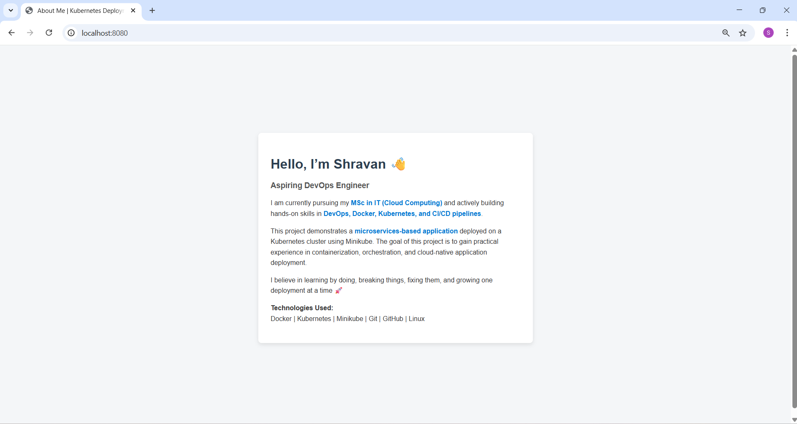
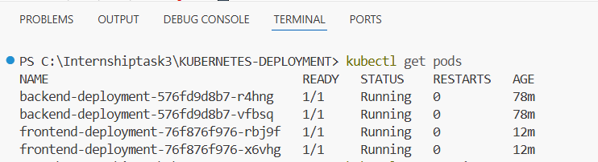
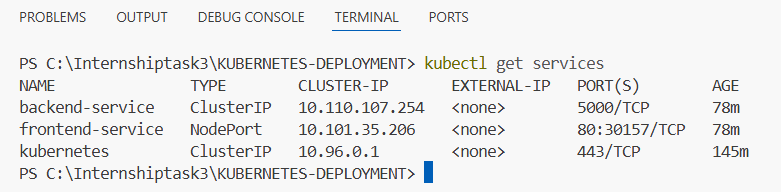

## KUBERNETES DEPLOYMENT – MICROSERVICES APPLICATION

This project demonstrates the deployment of a microservices-based application on a Kubernetes cluster using Minikube.

The main objective of this task is to understand containerization, Kubernetes deployments, and service exposure in a practical way.

## PROJECT OVERVIEW

The application consists of two microservices:

1. Frontend Service  
- Built using HTML  
- Served using Nginx  
- Displays an “About Me” page  

2. Backend Service  
- Built using Python Flask  
- Provides a simple API response  

Both services are containerized using Docker and deployed on Kubernetes.

## TOOLS AND TECHNOLOGIES USED

- Docker  
- Kubernetes  
- Minikube  
- Git & GitHub  
- Linux  

## PROJECT STRUCTURE

### frontend/
- index.html
- Dockerfile

### backend/
- app.py
- Dockerfile

### k8s/
- frontend-deployment.yaml
- frontend-service.yaml
- backend-deployment.yaml
- backend-service.yaml

### images/
- frontend-ui.png
- pods-running.png
- services-running.png

## KUBERNETES DEPLOYMENT STEPS

1. Docker images for frontend and backend were created.
2. Images were pushed to Docker Hub.
3. A local Kubernetes cluster was started using Minikube.
4. Kubernetes Deployment and Service YAML files were applied.
5. Pods and services were verified.
6. The frontend was accessed using kubectl port-forward.

## APPLICATION OUTPUT

Frontend Application Output:

## KUBERNETES POD STATUS

The following screenshot shows all frontend and backend pods running successfully:

## KUBERNETES SERVICES

The following screenshot shows the services created for frontend and backend:

## CONCLUSION

This project helped me understand how microservices can be deployed on Kubernetes using Docker and Minikube.

I learned how to:
- Create Docker images
- Deploy applications using Kubernetes YAML files
- Expose services using NodePort and ClusterIP
- Debug common Kubernetes issues

This task was completed as part of a DevOps internship to gain hands-on experience with Kubernetes deployments.
